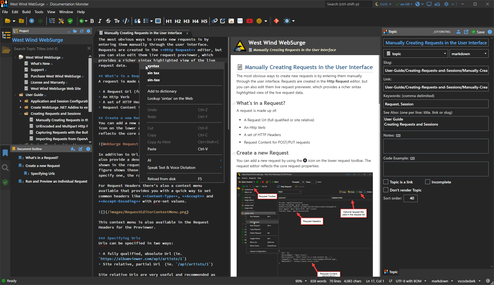

# Documentation Monster

[](https://documentationmonster.com/download)

<!--[](https://chocolatey.org/packages/MarkdownMonster)-->
<!--[](https://chocolatey.org/packages/MarkdownMonster)-->


> [!NOTE]
> Documentation Monster is still under construction and in Alpha. For now this site is set up for purposes of bug reports and feedback to early testers.

Documentation Monster is a markdown based documentation solution...

Documentation Monster is based on Markdown Monster which is a rich Markdown Editor and uses many of the same Markdown editor features.

* [Documentation Monster Web Site](https://documentationmonster.com)
* [See what's new](Changelog.md)  
* [License](#license)
* [Download](https://documentationmonster/download)
* [Buy a license](https://documentationmonster.com/purchase)
 


> ### Show your Support
> If you like what you see here, please consider **starring this repo** (click the :star: in the top right corner of this page). If you have a favorite feature in Markdown Monster, it'd be awesome if you could tweet about it and mention [@documentationmonster](https://x.com/documentationmonster). Please help us spread the word. 

## Installation

### Download Installer
You can download Documentation Monster using the self-contained installer:

[Download Documentation Monster](http://documentationmonster.com/download)

*This installer always provides the newest available version. All the other package managers versions might lag behind.*


<!--### Chocolatey-->

<!--You can you use [Chocolatey](https://chocolatey.org/) to install from the Windows Command Prompt *(maintained by us - always up to date)*-->

<!--```ps-->
<!--c:\> choco install documentation-monster-->
<!--```-->

<!--### WinGet-->
<!--You can also use the built-in Windows WinGet tool:-->

<!--```ps-->
<!--c:\> winget install documentation-monster-->
<!--```-->

<!--### Scoop-->
<!--You can also use [Scoop](https://scoop.sh/) to install and update. You need to use the `extras` bucket. *(not maintained by us)*-->

<!--```ps-->
<!--c:\> scoop install documentation-monster-->
<!--```-->

## License
Documentation Monster is a licensed product and while we provide a fully functional, free download, **for continued use a reasonably priced license is required**.

For more detailed info on licensing please visit licensing information here:

[Documentation Monster Licensing](https://documentationmonster.com/purchase#License)

## Screen Shots

#### Main Window
Here's what main Documentation Monster Window looks like: 




#### Html Output Generation:


#### Generated Html Web Site Output


#### Ftp Publishing


#### Customizable Html Render Templates:


#### Intra Project Topic Linking


#### WARRANTY DISCLAIMER: NO WARRANTY!

YOU EXPRESSLY ACKNOWLEDGE AND AGREE THAT USE OF THE LICENSED APPLICATION IS AT YOUR SOLE RISK AND THAT THE ENTIRE RISK AS TO SATISFACTORY QUALITY, PERFORMANCE, ACCURACY AND EFFORT IS WITH YOU. TO THE MAXIMUM EXTENT PERMITTED BY APPLICABLE LAW, THE LICENSE APPLICATION AND ANY SERVICES PERFORMED OR PROVIDED BY THE LICENSED APPLICATION ("SERVICES") ARE PROVIDED "AS IS" AND "AS AVAILABLE," WITH ALL FAULTS AND WITHOUT WARRANTY OF ANY KIND, AND APPLICATION PROVIDER HEREBY DISCLAIMS ALL WARRANTIES AND CONDITIONS WITH RESPECT TO THE LICENSED APPLICATION AND ANY SERVICES, EITHER EXPRESS, IMPLIED OR STATUTORY, INCLUDING, BUT NOT LIMITED TO, THE IMPLIED WARRANTIES AND/OR CONDITIONS OF MERCHANTABILITY, OF SATISFACTORY QUALITY, OF FITNESS FOR A PARTICULAR PURPOSE, OF ACCURACY, OF QUIET ENJOYMENT, AND NON-INFRINGEMENT OF THIRD PARTY RIGHTS. APPLICATION PROVIDER DOES NOT WARRANT AGAINST INTERFERENCE WITH YOUR ENJOYMENT OF THE LICENSED APPLICATION, THAT THE FUNCTIONS CONTAINED IN, OR SERVICES PERFORMED OR PROVIDED BY, THE LICENSED APPLICATION WILL MEET YOUR REQUIREMENTS, THAT THE OPERATION OF THE LICENSED APPLICATION OR SERVICES WILL BE UNINTERRUPTED OR ERROR-FREE, OR THAT EFFECTS IN THE LICENSED APPLICATION OR SERVICES WILL BE CORRECTED. NO ORAL OR WRITTEN INFORMATION OR ADVICE GIVEN BY APPLICATION PROVIDER OR ITS AUTHORIZED REPRESENTATIVE SHALL CREATE A WARRANTY. SHOULD THE LICENSED APPLICATION OR SERVICES PROVE DEFECTIVE, YOU ASSUME THE ENTIRE COST OF ALL NECESSARY SERVICING, REPAIR OR CORRECTION.

IN NO EVENT SHALL THE AUTHOR, OR ANY OTHER PARTY WHO MAY MODIFY AND/OR REDISTRIBUTE THIS PROGRAM AND DOCUMENTATION, BE LIABLE FOR ANY COMMERCIAL, SPECIAL, INCIDENTAL, OR CONSEQUENTIAL DAMAGES ARISING OUT OF THE USE OR INABILITY TO USE THE PROGRAM INCLUDING, BUT NOT LIMITED TO, LOSS OF DATA OR DATA BEING RENDERED INACCURATE OR LOSSES SUSTAINED BY YOU OR LOSSES SUSTAINED BY THIRD PARTIES OR A FAILURE OF THE PROGRAM TO OPERATE WITH ANY OTHER PROGRAMS, EVEN IF YOU OR OTHER PARTIES HAVE BEEN ADVISED OF THE POSSIBILITY OF SUCH DAMAGES.
   
---
&copy; Rick Strahl, West Wind Technologies, 2016-2021